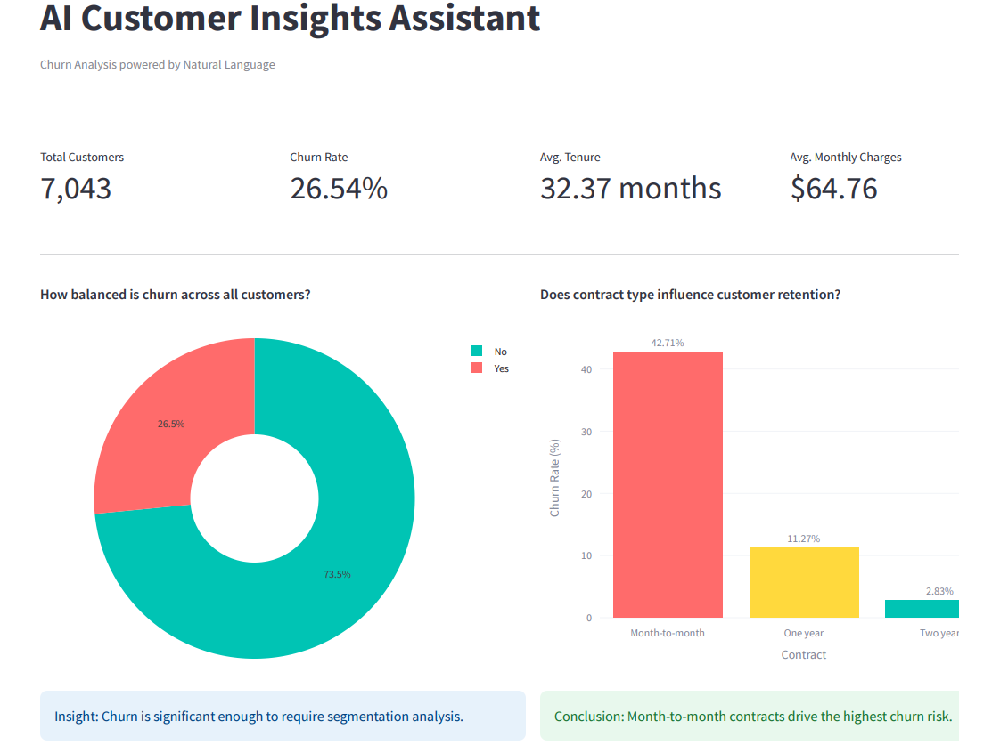

# AI Customer Insights Assistant
A business-focused AI analytics dashboard that enables natural language querying 
of customer churn data and generates executive-level insights using large language models.

Built as a portfolio project demonstrating the intersection of AI, data analysis, 
and business communication.

## Live Demo
[Launch App](https://ai-insights-assistant.streamlit.app)

## Overview
This application allows non-technical business users to interact with a structured 
dataset using plain English questions. The underlying LLM interprets the data context 
and returns structured, actionable insights formatted for a business audience.

## Features
- Four live KPI metrics: total customers, churn rate, average tenure, average monthly charges
- Churn distribution donut chart
- Churn rate by contract type bar chart
- Churn rate by internet service type bar chart
- Tenure distribution line chart comparing churned vs retained customers
- Natural language question interface powered by Meta Llama 3.1 8B via HuggingFace
- Suggested business questions for non-technical users
- Collapsible dataset summary panel
- Insight callouts per chart for business storytelling

## Tech Stack
| Layer | Technology |
|---|---|
| Frontend | Streamlit |
| Data Processing | Pandas |
| Visualizations | Plotly |
| LLM Integration | HuggingFace Inference API |
| Language Model | Meta Llama 3.1 8B Instruct |
| Language | Python 3.13 |


## Dataset
IBM Telco Customer Churn Dataset — 7,043 customer records with attributes including 
contract type, internet service, tenure, monthly charges, and churn status.

Source: IBM Developer / telco-customer-churn-on-icp4d

## Project Structure
```
ai-insights-assistant/
├── app.py               # Main application
├── requirements.txt     # Project dependencies
├── .gitignore           # Excludes .env and venv
└── README.md            # Project documentation
```

## Local Setup
**1. Clone the repository**
```
git clone https://github.com/kduffuor/AI-Insights-Assistant.git
cd AI-Insights-Assistant
```

**2. Create and activate a virtual environment**
```
python -m venv venv
venv\Scripts\activate        # Windows
source venv/bin/activate     # Mac/Linux
```

**3. Install dependencies**
```
pip install -r requirements.txt
```

**4. Create a `.env` file in the root directory**
```
HF_API_TOKEN=your_huggingface_token_here
```

**5. Run the app**
```
streamlit run app.py
```

## Screenshot
